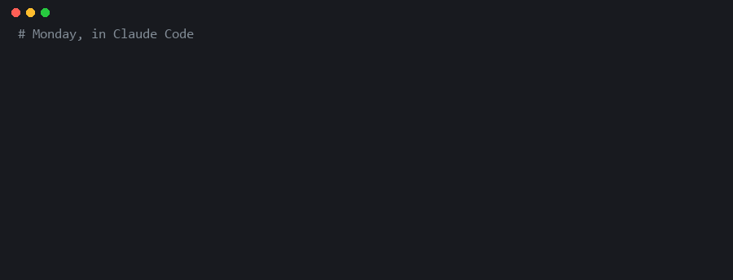

<!-- mcp-name: io.github.goyohan0611-png/graph-mind -->
<div align="center">

# Graph-MIND

Local-first memory for AI coding assistants. Verbatim storage, on your own PC:
**88.8% on LongMemEval with zero model calls at write time.**

[![][license-shield]][license-link]
[![][python-shield]][python-link]
[![][platform-shield]][platform-link]
[![][longmemeval-shield]][benchmarks-link]
[![][ci-shield]][ci-link]
[![][pypi-shield]][pypi-link]

*Switch models; keep the memory.*



<sub>A real run, not a mock-up: <code>python demo/record_demo.py</code> records it from a fresh store.</sub>

</div>

> [!NOTE]
> **Alpha.** Used daily on Windows 11, and checked in a fresh-install, two-PC end-to-end run.
> The test suite also passes on Linux and macOS in CI, but nobody has used it day to day there yet.

---

## What it is

Graph-MIND records every conversation you have with **Claude Code, Codex and Claude Desktop**, word
for word, in a store on your own PC. When a question depends on the past, the model you are using
calls Graph-MIND over MCP and gets back a few thousand tokens of the conversations that answer it.

- **Nothing is summarised or rewritten.** Saving is a database write. No model call, no tokens.
- **Search is hybrid.** Your words are embedded on your PC (multilingual MiniLM, no API) and fused
  with keyword search. Korean and English both work.
- **Capture is automatic.** A background service reads each app's local transcripts, masks secrets,
  stores the turns and embeds them as they arrive.
- **One memory across your PCs.** One sentence to the AI on the first PC, one command on the
  others (see [below](#one-memory-across-pcs)).
- **No cloud of its own.** No account, no telemetry; the memory stays on your machines. What
  leaves them is what your AI app already sends: the recalled turns go to your model's
  provider with your question.

---

## Benchmarks

All numbers below come from files in this repository: the pre-registrations, each question's
answer, and the judge's verdict on it, under [`runs/`](runs). The method is in
[REPORT.md](REPORT.md), including the failures and the corrections.

**LongMemEval_S: answer accuracy, 500 questions.** The answer model is gpt-5-mini; the judge is the
official gpt-4o-2024-08-06.

| | accuracy | model tokens at write time | packet read per question |
|---|---|---|---|
| **All 500 questions** | **88.8%** (444/500) | **0** | 3.4k tokens |
| The 380 never used for tuning | **86.8%** (330/380) | 0 | 3.4k tokens |

**Head to head: same 40 questions, same answer model, prompt and judge.** The run was
pre-registered with code hashes; nobody had tuned on these questions.

| system | accuracy | model tokens at write time, per question |
|---|---|---|
| **Graph-MIND** (shipped path, earlier 20-item packet) | **85.0%** | **0** |
| MemPalace 3.10.0 | 57.5% | 0 |
| Mem0 2.2.1 (open source, latest on PyPI) | 52.5% | ~640k |

Graph-MIND's lead over both is significant (exact McNemar p = 0.002 and 0.003).

**Reading other published numbers.** They measure different things, so they do not compare
directly with the tables above:

- **MemPalace's 96.6%** is retrieval recall (R@5): is the right session among the five returned?
  This table measures whether the final answer is correct.
- **Mem0's 94.4%** is its managed cloud platform, which includes proprietary components. The open
  source package tested here is a different system.
- **Mastra (94.87%), Emergence (86%), Supermemory (85.2%) and Zep (71.2%)** report their own setups
  and answer models. They were not reproduced here.

As far as we know, everything above 85% on that list runs a model over your conversations when it
saves them. Graph-MIND does not.

---

## Install

Requires Python 3.10+ (64-bit). Windows, macOS or Linux. Hosting a brain that other PCs join
needs Python 3.12 or older on that one PC (its Postgres helper, pgserver, has no newer build yet);
everything else, joining included, works on 3.13 and 3.14 too.

```bash
pip install graph-mind-memory
graph-mind-install
```

If `graph-mind-install` is "not recognized", pip put it in a Scripts folder that is not on your
PATH (common with the Windows Python install manager). `python -m install` runs the same thing.
If it stops with `WinError 1114` loading `c10.dll`, Windows is missing the Microsoft Visual C++
runtime that PyTorch needs: install [vc_redist.x64.exe](https://aka.ms/vs/17/release/vc_redist.x64.exe),
restart, and run the installer again.

or from source:

```bash
git clone https://github.com/goyohan0611-png/graph-mind.git
cd graph-mind
python install.py
```

The installer:

- installs the packages (PyTorch CPU is the large one, about 2 GB);
- registers the MCP server with every app it finds: Claude Code, Claude Desktop (including the
  Microsoft Store build) and Codex;
- starts the capture service at login (Windows Startup folder, a macOS LaunchAgent, or an XDG
  autostart entry on Linux);
- downloads the embedding model.

Then restart your AI apps. The server is also listed in the
[MCP Registry](https://registry.modelcontextprotocol.io) as `io.github.goyohan0611-png/graph-mind`. Running the installer again is safe. Run it again if you move the folder.

> [!TIP]
> If `pip` fails with "No such file or directory", Windows' 260-character path limit is the usual
> cause. Clone to a short path such as `C:\graph-mind`, or enable long paths. The installer prints
> the command for that.

---

## What it captures

| app | captured |
|---|---|
| Codex: terminal, VS Code, ChatGPT desktop's work mode | every turn |
| Claude Code: terminal, VS Code, Claude desktop's Code tab | every turn |
| Claude desktop: Cowork | every turn |
| Claude desktop: chat | what the model saves with `brain_remember` |

Before anything is stored, these are masked: API keys, tokens from GitHub, AWS, Google and Slack,
private keys, passwords inside URLs, values written after `password:` / `api_key=` / `token:`,
and any long machine-random string even from a service no rule knows (by its randomness: 91% of
random 20-64 character tokens caught; in 246,750 ordinary chat turns it fired 92 times, nearly
all on real ids and tokens). Commit ids, hashes and UUIDs are kept, since you recall those on
purpose.

There is no switch to keep keys: a recalled memory goes to your model's provider with the question,
so a stored key would leave your PC the first time it is useful. To have Graph-MIND remember a key,
tell it **where the key is**, not the key: *"my OpenAI key is in 1Password, under Dev"*.

Only what you actually send is captured: the service reads each app's transcript, which is written
after you press Enter, so a paste you delete before sending never reaches it. A plain password
like `hunter2` has no recognizable format and is **not** masked. To remove something,

just ask your AI: *"delete the password I typed earlier"*. It lists masked candidates
(`wifi password is ****`), deletes only the ones you pick, and the conversation about deleting
is not saved. Or, from a terminal:

```bash
graph-mind-forget          # asks for the phrase without showing it, then confirms
```

Either way, what you pick is deleted from this PC and its search indexes, from the shared memory,
and from your other PCs on their next sync; only ids are shared for that, never the text. Your AI
app's own history (for Claude Code, `~/.claude/projects`) is separate and is not touched.

---

## MCP tools

| tool | what it does |
|---|---|
| `brain_context` | a bounded packet of the past turns and memories that answer a request; `recent=true` for "where did we leave off?" |
| `brain_recall` | look memories and captured turns up directly; `entity=` for everything about one thing, in order |
| `brain_remember` | save a sourced memory or decision (secrets masked) |
| `brain_folder` | where the memory lives; share it with your other PCs; reindex an imported backlog |
| `brain_forget` | "delete the password I typed": lists masked candidates, deletes only what you pick, everywhere; the exchange itself is not saved |
| `code_activity` | what changed in a project, file or symbol, and when (when a code folder is watched) |

Six tools on purpose: every tool's description is read by the model on every turn, and similar
tools get confused with each other. Version 0.1 had thirteen.

---

## One memory across PCs

On the PC that holds the memory, tell its AI:

> *"Let my other PCs use this memory."*

It replies with a connection code (`gm1.…`). On each other PC:

```bash
graph-mind-install --join gm1.…     # or: python install.py --join gm1.…
```

The memory then lives in a Postgres server on the first PC, which Graph-MIND sets up itself. Other
PCs reach it over the local network in the office, or over [Tailscale](https://tailscale.com) from
anywhere. Each connection tries the addresses in turn and uses the first that answers.

Other PCs log in with a generated password, as a role that can reach only the memory database. The
Windows firewall rule admits only the local network and Tailscale. The code contains the password:
do not post it publicly.

A synced folder also works. Tell the AI *"use my Google Drive's Graph-MIND folder as my memory"* on
each PC.

---

## Reproducing the benchmarks

1. Download `longmemeval_s_cleaned.json` from [LongMemEval](https://github.com/xiaowu0162/LongMemEval)
   into `external/longmemeval/`.
2. Set `OPENAI_API_KEY` for the answer model and the judge.
3. Run the commands in [REPORT.md §10](REPORT.md#10-reproducing).

A full 500-question run costs about US$3.

## Tests

```bash
python -m unittest discover -p "test_*.py"
```

---

## Known limits

- **The first question after an AI app starts waits for the embedding model to load** (a few
  seconds; 30-50 s on a slow or synced disk). Later questions take well under a second.
- **Daily use on Windows only so far.** macOS and Linux pass the tests in CI but have not seen real
  use.
- **Capture follows each app's transcript format,** which is not a public interface. An app update
  can stop capture until Graph-MIND is updated.
- **Multi-session questions are the weakest type at 80%.** These are questions that count or
  combine facts across many conversations.
- **The repository still holds the research-phase experiments** next to the product (see
  [Repository layout](#repository-layout)); the installed package carries only the 22 product
  modules.

The full list is in [REPORT.md §9](REPORT.md#9-known-limits).

## Repository layout

| | files |
|---|---|
| **Product** (what `pip install graph-mind-memory` installs) | `graph_mind_mcp_server.py` (MCP server), `automatic_capture*.py` (capture service), `install.py`, `brain_log.py` (sharing across PCs), `forget.py` (deleting), `local_brain.py` / `conversation_memory.py` / `coding_memory.py` / `development_memory.py` (stores), `semantic_recall.py` / `local_embedder.py` / `vector_cache.py` / `embedding_warmup.py` (search), and their helpers |
| **Benchmarks** | `product_answer_eval.py`, `official_judge_v073.py`, `rival_mem0.py`, `rival_mempalace.py`, `rival_clean_prereg.py`, and the result files under `runs/` |
| **Research phase** | the other modules: earlier extraction pipelines and analyses that REPORT.md cites |
| **Tests** | `test_*.py` |

## Contributing

Issues and pull requests are welcome. Contributions are accepted under the [CLA](CLA.md), which
keeps the dual license possible.

## License

[AGPL-3.0](LICENSE). Anyone running a modified Graph-MIND as a network service, such as the memory
behind a support chatbot, must publish that source. A [commercial license](COMMERCIAL.md) is
available for products that cannot.

<!-- Links -->
[license-shield]: https://img.shields.io/badge/license-AGPL--3.0-4dc9f6?style=flat-square
[license-link]: LICENSE
[python-shield]: https://img.shields.io/badge/python-3.10+-7dd8f8?style=flat-square&logo=python&logoColor=white
[python-link]: https://www.python.org/
[platform-shield]: https://img.shields.io/badge/platform-Windows%20%7C%20macOS%20%7C%20Linux-b0e8ff?style=flat-square
[platform-link]: #known-limits
[longmemeval-shield]: https://img.shields.io/badge/LongMemEval-88.8%25-2ea44f?style=flat-square
[benchmarks-link]: #benchmarks
[ci-shield]: https://img.shields.io/github/actions/workflow/status/goyohan0611-png/graph-mind/tests.yml?style=flat-square&label=tests
[ci-link]: https://github.com/goyohan0611-png/graph-mind/actions/workflows/tests.yml
[pypi-shield]: https://img.shields.io/pypi/v/graph-mind-memory?style=flat-square&label=pypi
[pypi-link]: https://pypi.org/project/graph-mind-memory/
